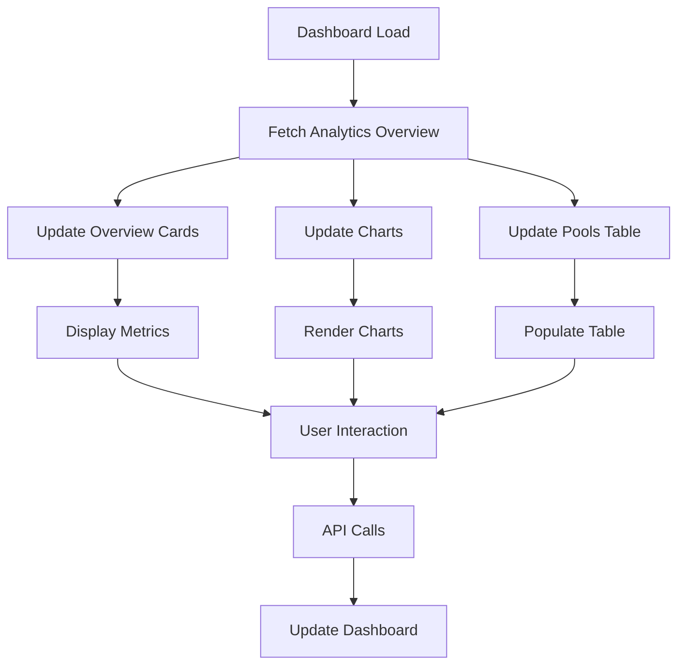

# Prospects Analytics Dashboard Guide

## 📋 Overview

The Prospects Analytics Dashboard is a modern, interactive web interface that
provides comprehensive analytics and management tools for TeamTailor prospect
pools. It offers real-time insights, data visualization, and advanced management
capabilities.

## 🚀 Quick Start

### Accessing the Dashboard

#### Test Mode (Recommended for Development)

1. **Start the server in test mode**:

   ```bash
   ./scripts/start_server.sh test
   ```

   This will start the server with mock data for testing.

#### Production Mode (Real TeamTailor API)

1. **Start the server in production mode**:

   ```bash
   ./scripts/start_server.sh prod
   ```

   This will connect to the real TeamTailor API.

2. **Open the dashboard**:
   - Navigate to: `http://localhost:8000/dashboard/`
   - Or run: `python scripts/test_dashboard.py`

### Dashboard URL Structure

- **Main Dashboard**: `http://localhost:8000/dashboard/`

- **Dashboard Health**: `http://localhost:8000/dashboard/health`

- **Static Files**: `http://localhost:8000/dashboard/static/{filename}`

## 🎨 Dashboard Features

### 1. Overview Cards

The dashboard displays four key metrics at the top:

- **Total Pools**: Number of prospect pools in TeamTailor

- **Total Candidates**: Total number of candidates across all pools

- **Unique Tags**: Number of unique tags used across all candidates

- **Average per Pool**: Average number of candidates per pool

### 2. Interactive Charts

#### Tags Distribution Chart

- **Type**: Doughnut chart

- **Data**: Top 10 most used tags across all prospect pools

- **Features**:
  - Hover for detailed information
  - Percentage calculations
  - Color-coded segments

#### Data Completion Rates Chart

- **Type**: Bar chart

- **Data**: Average completion rates for email, phone, and LinkedIn data

- **Features**:
  - Percentage-based visualization
  - Color-coded bars (Blue: Email, Green: Phone, Purple: LinkedIn)
  - Tooltip with exact percentages

### 3. Pools Analytics Table

A comprehensive table showing detailed information for each prospect pool:

| Column            | Description                                   |
| ----------------- | --------------------------------------------- |
| **Pool**          | Pool name and description with icon           |
| **Candidates**    | Number of candidates in the pool              |
| **Email Rate**    | Percentage of candidates with email addresses |
| **Phone Rate**    | Percentage of candidates with phone numbers   |
| **LinkedIn Rate** | Percentage of candidates with LinkedIn URLs   |
| **Actions**       | Quick action buttons (View, Export, Analyze)  |

#### Table Features

- **Search**: Filter pools by name

- **Sort**: Sort by name, candidate count, or completion rate

- **Interactive Rows**: Click any row to view detailed pool information

- **Action Buttons**:
  - 👁️ **View**: Open detailed pool modal
  - 📥 **Export**: Download pool data as CSV
  - 📊 **Analyze**: Run duplicate analysis

### 4. Quick Actions

Three action cards for common tasks:

#### Export Data

- **Function**: Export all analytics data as CSV

- **Includes**: Overview metrics and pool analytics

- **Format**: Structured CSV with multiple sections

#### Search & Filter

- **Function**: Advanced search and filtering (coming soon)

- **Features**: Will include complex filtering options

#### Settings

- **Function**: Dashboard configuration (coming soon)

- **Features**: Will include customization options

## 🔧 Technical Architecture

### Frontend Technologies

- **HTML5**: Semantic markup with modern structure

- **Tailwind CSS**: Utility-first CSS framework for styling

- **Chart.js**: Interactive charts and data visualization

- **Font Awesome**: Icons and visual elements

- **Vanilla JavaScript**: No framework dependencies

### Backend Integration

- **FastAPI**: RESTful API endpoints

- **CORS**: Cross-origin resource sharing enabled

- **Static File Serving**: Direct file serving for dashboard assets

### API Endpoints Used

The dashboard integrates with these API endpoints:

- `GET /prospects/analytics/overview` - Main analytics data

- `GET /prospects/pools/{id}/stats` - Pool statistics

- `POST /prospects/pools/{id}/candidates/export` - Export pool data

- `POST /prospects/pools/{id}/duplicates/analyze` - Analyze duplicates

- `POST /prospects/pools/{id}/candidates/validate` - Validate data

## 📊 Data Flow



## 🎯 User Interactions

### 1. Refreshing Data

- **Refresh Button**: Click the refresh button in the header

- **Auto-refresh**: Data is loaded on page load

- **Last Update**: Timestamp shows when data was last refreshed

### 2. Pool Management

#### Viewing Pool Details

1. Click on any pool row in the table

2. Modal opens with detailed information

3. View pool statistics and metadata

4. Access quick actions (Export, Analyze, Validate)

#### Exporting Pool Data

1. Click the export button (📥) in the actions column

2. Or use the export button in the pool details modal

3. CSV file is automatically downloaded

#### Analyzing Pool Data

1. Click the analyze button (📊) in the actions column

2. Duplicate analysis is performed

3. Results are displayed in an alert

#### Validating Pool Data

1. Click the validate button in the pool details modal

2. Data validation is performed

3. Validation score and issues are displayed

### 3. Chart Interactions

#### Tags Chart

- **Hover**: See tag name, count, and percentage

- **Legend**: Click legend items to show/hide segments

- **Responsive**: Automatically adjusts to container size

#### Completion Rates Chart

- **Hover**: See exact percentage values

- **Responsive**: Automatically adjusts to container size

- **Color Coding**: Consistent color scheme across dashboard

### 4. Table Interactions

#### Searching

- **Real-time**: Type in the search box to filter pools

- **Case-insensitive**: Search works regardless of case

- **Instant**: Results update as you type

#### Sorting

- **Multiple Options**: Sort by name, candidates, or completion rate

- **Persistent**: Sort preference is maintained during search

## 🛠️ Customization

### Styling

The dashboard uses Tailwind CSS classes for styling. Key customization points:

```css
/* Header gradient */
.gradient-bg {
  background: linear-gradient(135deg, #667eea 0%, #764ba2 100%);
}

/* Card hover effects */
.card-hover {
  transition: all 0.3s ease;
}

.card-hover:hover {
  transform: translateY(-5px);
  box-shadow: 0 10px 25px rgba(0, 0, 0, 0.1);
}
```

### Chart Colors

Chart colors can be customized in the JavaScript file:

```javascript
// Tags chart colors
backgroundColor: [
  "#3B82F6",
  "#10B981",
  "#F59E0B",
  "#EF4444",
  "#8B5CF6",
  "#06B6D4",
  "#84CC16",
  "#F97316",
  "#EC4899",
  "#6366F1",
];

// Completion rates chart colors
backgroundColor: ["#3B82F6", "#10B981", "#8B5CF6"];
```

### API Configuration

The dashboard API base URL can be configured:

```javascript
class ProspectsDashboard {
  constructor() {
    this.apiBaseUrl = "http://localhost:8000"; // Change this for production
    // ...
  }
}
```

## 🧪 Test Mode

The dashboard includes a test mode that provides mock data for development and
testing purposes.

### Enabling Test Mode

Set the environment variable `TEAMTAILOR_TEST_MODE=true` before starting the
server:

```bash
export TEAMTAILOR_TEST_MODE=true
pipenv run uvicorn main:app --reload --host 0.0.0.0 --port 8000
```

Or use the provided script:

```bash
./scripts/start_server.sh test
```

### Test Data

When in test mode, the dashboard will display:

- **5 prospect pools** with realistic names and descriptions

- **1,247 total candidates** distributed across pools

- **23 unique tags** with realistic job titles

- **Completion rates** for email, phone, and LinkedIn data

- **Interactive charts** with sample data

### Switching Between Modes

- **Test Mode**: `./scripts/start_server.sh test`

- **Production Mode**: `./scripts/start_server.sh prod`

## 🔍 Troubleshooting

### Common Issues

#### Dashboard Not Loading

1. **Check server**: Ensure FastAPI server is running

2. **Check URL**: Verify the correct dashboard URL

3. **Check console**: Look for JavaScript errors in browser console

#### Charts Not Displaying

1. **Check Chart.js**: Ensure Chart.js library is loaded

2. **Check data**: Verify API is returning valid data

3. **Check console**: Look for JavaScript errors

#### API Errors

1. **Check network**: Verify API endpoints are accessible

2. **Check CORS**: Ensure CORS is properly configured

3. **Check authentication**: Verify TeamTailor API credentials

#### Export Not Working

1. **Check browser**: Ensure browser allows downloads

2. **Check API**: Verify export endpoints are working

3. **Check format**: Ensure correct export format is specified

### Debug Mode

Enable debug mode by adding this to the browser console:

```javascript
localStorage.setItem("dashboard_debug", "true");
```

This will show additional logging information.

## 📈 Performance Optimization

### Loading Optimization

- **Lazy Loading**: Charts are only rendered when visible

- **Debounced Search**: Search input is debounced to reduce API calls

- **Cached Data**: Data is cached to reduce redundant API calls

### Memory Management

- **Chart Cleanup**: Old charts are properly destroyed before creating new ones

- **Event Cleanup**: Event listeners are properly managed

- **Modal Cleanup**: Modals are properly closed and cleaned up

## 🔮 Future Enhancements

### Planned Features

1. **Real-time Updates**: WebSocket integration for live data updates

2. **Advanced Filtering**: Complex filtering and search options

3. **Custom Dashboards**: User-configurable dashboard layouts

4. **Export Formats**: Additional export formats (Excel, PDF)

5. **Notifications**: Real-time notifications for data changes

6. **User Preferences**: Save user preferences and settings

### Technical Improvements

1. **Progressive Web App**: PWA capabilities for offline access

2. **Service Workers**: Background sync and caching

3. **Performance Monitoring**: Built-in performance metrics

4. **Accessibility**: Enhanced accessibility features

5. **Internationalization**: Multi-language support

## 📚 Related Documentation

- [Enhanced Prospects API](../api/PROSPECTS_ENHANCED_API.md)

- [TeamTailor API Endpoints](../api/TEAMTAILOR_API_ENDPOINTS.md)

- [Migration Guide](../guides/MIGRATION_GUIDE.md)

- [Development Setup](../development/contributing.md)

## 🤝 Contributing

To contribute to the dashboard:

1. **Fork the repository**

2. **Create a feature branch**

3. **Make your changes**

4. **Test thoroughly**

5. **Submit a pull request**

### Development Setup

```bash
# Install dependencies
pipenv install

# Start development server
pipenv run uvicorn main:app --reload

# Test dashboard
python scripts/test_dashboard.py
```

### Code Style

- **JavaScript**: Follow ES6+ standards

- **HTML**: Use semantic HTML5

- **CSS**: Use Tailwind CSS utilities

- **Comments**: Include JSDoc comments for functions

---

**Dashboard Version**: 1.0.0
**Last Updated**: August 2024
**Maintainer**: Development Team
